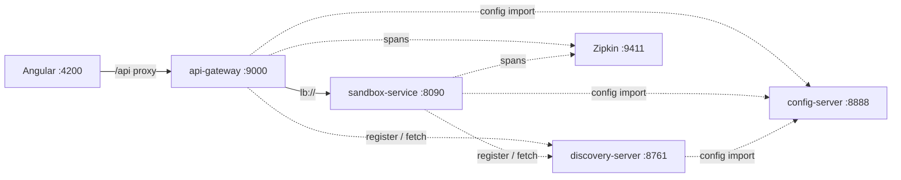

# Configuration, Discovery & Gateway

Config Server → Eureka → API Gateway, in a nutshell.



## Startup order

Docker infra first (`docker compose up -d`), then:

| # | Service | Port | Why here |
|---|---------|------|----------|
| 1 | `config-server` | 8888 | Everyone imports it at boot |
| 2 | `discovery-server` | 8761 | Services register at boot |
| 3 | `sandbox-service` | 8090 | Registers in Eureka |
| 4 | `api-gateway` | 9000 | **Last**: resolves `lb://` from the Eureka registry |

> [!NOTE]
> The config import is `optional:` — a service started before the Config Server boots silently on defaults. After starting the gateway, wait ~30 s (Eureka refresh) before the first call.

```bash
curl http://localhost:9000/api/sandbox/config/test-property   # hello-from-config-server
```

## Configuration

Each service keeps a minimal local `application.yaml` (name + import). Everything else lives in `../../server/platform/config-server/src/main/resources/configurations`.

```yaml
spring:
  config:
    import: optional:configserver:http://localhost:8888
  application:
    name: sandbox-service   # must match configurations/<name>.yml
```

| File | Use for |
|------|---------|
| `configurations/application.yml` | Shared by all services (Eureka, tracing) |
| `configurations/<service-name>.yml` | One service only (port, DB, routes, business props) |

**Priority (highest wins):** env vars / `-D` / CLI args → `<service-name>.yml` → `application.yml` → local `application.yaml`.

**Add a property:** edit the right file → restart Config Server → restart the service → check `Located environment: name=<service>` in its log.

## API Gateway

Spring Cloud Gateway **MVC** (servlet). Single entry point, no business logic. Routes live in `configurations/api-gateway.yml`:

| Route id | Predicate | Target |
|----------|-----------|--------|
| `sandbox-service` | `Path=/api/sandbox/**` | `lb://sandbox-service` |

```yaml
# new route
- id: <service-name>
  uri: lb://<service-name>       # Eureka name, never a port
  predicates:
    - Path=/api/<prefix>/**
```

| Response | Meaning |
|----------|---------|
| `404` (JSON) | No route matches the path |
| `500` / `503` | Route matched, target not in Eureka (down or registry not refreshed) |

**Frontend:** `../../client/proxy.conf.json` proxies `/api` → `http://localhost:9000` only. Keys must be literal prefixes (`/api`, not `/api/*`).

## Tracing

One call through the gateway = **one Zipkin trace** (same `traceId`): gateway `SERVER` → gateway `CLIENT` → service `SERVER`. In the UI at `http://localhost:9411`, pick a service, then *Run query*.

> [!WARNING]
> Sampling is `1.0` in `configurations/application.yml` — dev only, lower it elsewhere.
