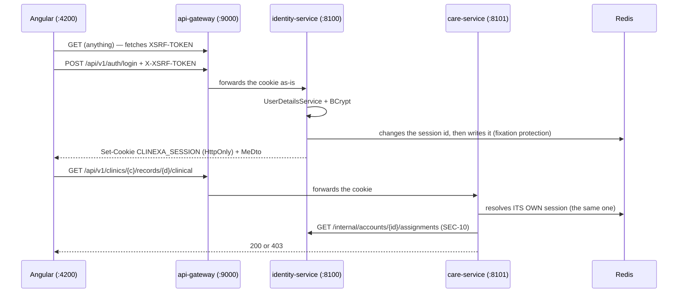

# Authentication

> `SEC-01`: **Spring Security, opaque session + Redis, users in the database.** Keycloak is deferred
> to Hardening (`SEC-12`) — and the foundation is built so that this switch costs a version *bump*,
> not a rewrite.
>
> Design: `Security/MVP/02-authentification.md`.

## The choice, and its trade-off

An **opaque session cookie**, not a self-contained token. The cookie carries **no rights**: only a
key to server-side state (Redis).

| Consequence | Detail |
|---|---|
| ✅ **Immediate revocation** | Destroying the session is enough. A non-expired JWT stays valid even revoked. |
| ⚠️ **CSRF becomes mandatory** | A cookie is attached by the browser to *any* request to the origin, including one forged from another site. An `Authorization: Bearer` header isn't. |
| ⚠️ **The gateway is not a trust boundary** | It forwards the cookie **as-is** and reads nothing. Each service resolves its own session — so it stays protected even when reached directly. |

## The flow



**`identity-service` is the only service that writes a session.** Every other service only reads
one. If session issuance ever appears anywhere else, this design is being violated.

## The pieces, and where they live

| Piece | Where | Note |
|---|---|---|
| `UserDetailsService` on `account` + BCrypt | `identity/authentication/AccountUserDetailsService` | Looked up on `lower(email)`, matching the unique index |
| `POST /api/v1/auth/login` · `/logout` · `GET /api/v1/me` | `identity/authentication/AuthenticationController` | The **only** place allowed to touch `SecurityContextHolder` and the session — INV-6 names it as the exemption. It calls the `SessionAuthenticationStrategy` **itself**: the chain's `changeSessionId()` setting only covers logins made by a filter, not this one (`AuthenticationTest` proves it) |
| Cookie `HttpOnly` `Secure` `SameSite=Lax` | `configurations/application.yml` | `secure: true` by default; `identity-service-dev.yml` sets it to `false` (local http) — only identity issues this cookie |
| CSRF, SPA recipe | `shared` · `security/web/SpaCsrfHandler` | Cookie `XSRF-TOKEN` readable by JS, token served on the very first `GET` |
| Spring Session + Redis, **shared** | `configurations/application.yml` | Same `namespace` everywhere: that's what makes the session common |
| `CurrentUserResolver` | `shared` · `security/identity/SessionCurrentUserResolver` | The **only** point in the code that knows the mechanism in use |
| Filter chain | `shared` · `security/web/SecurityChainBuilder` | Shared, and it **appends** `denyAll()` itself |

## What the principal carries — and above all, what it doesn't

`AuthenticatedAccount` (`shared` module, so **a single class** for both services, since the
session is serialized into Redis and read back on the other side) carries: `accountId`, `email`,
`actif`.

It carries **neither assignments nor authorities**, and that's not a gap to fill. A session lives
for hours; an assignment changes in a second (hire, departure, revocation). Putting them in the
principal would let a revoked account keep working until its session expires. So they are **read
on every request** and cached **only for the duration of that request** — beyond that, it would
quietly recreate the option that was already ruled out.

The password hash is `transient`: it's used to authenticate, never to sit in Redis.

## ⚠️ The gateway must keep no cookie — and by default, it does

**This is the most serious defect found during J3, and it broke nothing.**

Apache HttpClient 5 — the implementation Spring Boot picks as soon as it's on the classpath, and it
is — enables cookie management by default, with **one cookie store shared by the whole client**. A
gateway routes *every* user through that single client: so it kept the last logged-in user's
`CLINEXA_SESSION` cookie and replayed it upstream on **every** subsequent request.

Observed at runtime: a `GET /api/v1/me` **with no cookie at all** came back with someone else's
identity, their clinics, and their roles.

```
$ curl http://localhost:9000/api/v1/me          # no cookie sent
{"accountId":"…d0","email":"dan@clinic-b.ma","clinics":[…]}
```

Nothing failed, nothing was logged, every screen rendered. The fix is
`StatelessPassthroughConfiguration` (`platform/api-gateway`), which explicitly disables cookie
management, and `SessionLeakTest` locks it in — with a second test that checks the **default**
client really does replay the cookie: without it, the first test could quietly become meaningless.

> **The general rule, beyond this bug**: a gateway carries **no state** about who is calling. It
> forwards whatever cookie the client sent and keeps nothing. Same rule as "the gateway is not a
> trust boundary", applied to the connection rather than to authorization.

## Two details that break an SPA integration, with no clear message

1. **Same origin.** Angular's XSRF interceptor only attaches the header on the same origin. In dev,
   the `client/proxy.conf.json` proxy (`/api` → `:9000`) guarantees this: the browser only talks to
   `localhost:4200`. Without it, **every `POST` answers `403`** with no explanation.
2. **The token must have been seen.** Angular only adds the header if it has already received the
   `XSRF-TOKEN` cookie. Someone who lands directly on the login screen hasn't made any request yet:
   hence the call to `GET /api/v1/auth/csrf` before the `POST`. Server-side, `SpaCsrfHandler.handle`
   calls `csrfToken.get()` so the cookie actually gets written — with Spring Security 6+'s deferred
   loading, nothing writes it until someone reads the token.
3. **The cookie's name and the header's name are spelled out in black and white** in
   `SecurityChainBuilder` (`XSRF-TOKEN` / `X-XSRF-TOKEN`). These are Angular's defaults, and they're
   still explicit: a mismatch between the two sides produces a `403` that nothing explains. This
   isn't theoretical — another defect showed up exactly this way during J3.

## Development accounts — `SEC-05`

**There is no profile without security.** `SEC-05` explicitly refused one: such a profile always
ends up serving "just for this demo". What the team actually wanted was to not fight with login —
so it has provisioned accounts, and a chain **strictly identical** to production's.

`dev` profile (`-Dspring.profiles.active=dev`), Liquibase seed, shared password `Clinexa!2026`:

| Account | Role | Clinic |
|---|---|---|
| `alice@clinic-a.ma` | `PRACTITIONER` | A |
| `bob@clinic-a.ma` | `RECEPTIONIST` | A |
| `carol@clinic-a.ma` | `CLINIC_ADMIN` | A |
| `dan@clinic-b.ma` | `PRACTITIONER` | B |
| **`erin@clinexa.ma`** | **`PRACTITIONER`@A + `RECEPTIONIST`@B** | **A and B** |

`erin` is the fixture that reveals tenant bugs: legitimate on both sides, with different rights.

**A test session in under a minute** — otherwise the team will work around security:

```bash
pwsh _dev/session-smoke-test.ps1
```

The script validates the whole chain: CSRF token → login → `/api/v1/me` → **the same session
accepted by `care-service`** → logout → the session is worth nothing anymore.

## Watch the filter chain, once — guide 5.9

```yaml
logging.level.org.springframework.security: DEBUG
```

Do this **once per team**, on a real request. It's the one moment in the project where the
difference between authentication and authorization becomes concrete rather than theoretical.

## The patient OTP flow: **deferred to V3**

`SEC-02` defers the patient portal, and the OTP flow with it: none of the thirteen criteria test it,
and it depends on V3 building blocks (slots, SMS sending, `CMP-ENG` which owns OTP). **Nothing to
scaffold here.** Its structural constraints become the acceptance criteria of its own story:

- **Single-use** code, invalidated on first use.
- Short lifetime **and** an attempt counter carried by the data itself, not by config — without a
  counter, an OTP can be brute-forced.
- Right tied to the triplet **(verified number, slot, clinic)**, which opens **no** access to a
  patient record.
- **Constant-time** comparison, never a plaintext code in a log.

## Left to do before production

| Point | Decision |
|---|---|
| `Secure` cookie | Already `true` by default; only the `dev` profile of identity relaxes it. HTTPS still needs to be put in front, or the cookie is never sent back |
| mTLS on `/internal/**` (`SEC-08`) | Set aside at the foundation — trusted local Docker network — **to reopen** (`01-durcissement-applicatif` §6) |
| Keycloak (`SEC-12`) | Hardening. Expected cost: an OIDC implementation of `CurrentUserResolver` in `shared`, selected by profile. **No business service changed.** |
| MFA, rate limiting, security headers | Hardening |
