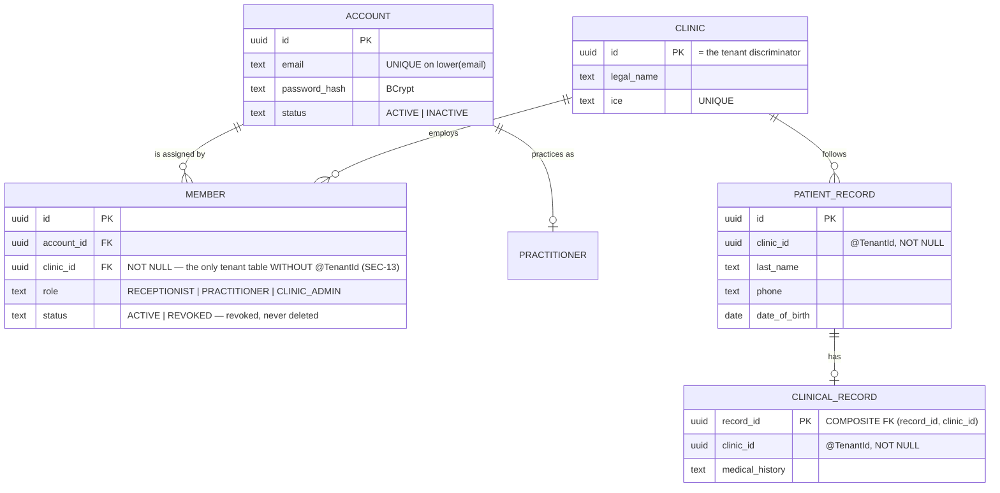

# Identity & tenant model

> The most irreversible subject in the project. A discriminator column added after the fact means a
> migration of **every** table plus a rewrite of **every** query.
>
> Design: `Security/MVP/01-identite-et-multi-tenant.md`, `design-v1/3-LLD/20-LLD-modele-de-donnees.md` §2 and §4.

## The vocabulary, never to be confused

| Term | What it is | Where |
|---|---|---|
| **Account** | An authenticatable identity, **global scope**. Carries no role. | `identity.account` |
| **Clinic** | **The tenant.** Its own `id` is the discriminator. | `identity.clinic` |
| **Member** | The `account × clinic` assignment, which **carries the role**. | `identity.member` |
| **Patient record** | **A clinic's patient.** There is no global patient identity. | `care.patient_record` |

## The foundation's ERD

## The three decisions that shape everything

### ① The role belongs to the `(account, clinic)` pair — invariant **I3**

`account` has **no** `role` column, and a test checks this at the schema level
(`SchemaAndEntitiesTest.accountHasNoRoleColumn`). The fixture that makes the invariant visible is
`erin`: `PRACTITIONER` in clinic A, `RECEPTIONIST` in clinic B. A model that puts the role on the
account **can't express this** — which is what makes this fixture decisive rather than decorative.

Combined rights within **the same** clinic are modeled as multiple member rows, never as a broader
role (I6). The `uq_member_role_active` index explicitly allows it: an account can be
`CLINIC_ADMIN` **and** `RECEPTIONIST` of the same clinic, never twice the same active role.

### ② No global `PATIENT` — `SEC-04`, "Resolution" of 2026-09-21

A clinic's patient **is** its patient record. The same person seen in two clinics has **two
distinct records, with no link at all in the database**. This isn't a duplicate to clean up: it's
what makes it impossible for B's record to surface on A's side — neither its content nor its
existence.

The global link will only make sense the day the patient portal exists, and will then be an
**additive** migration. Three rules keep patient enumeration out of reach:

1. **Physical separation** — `patient_record` carries identity and contact info, `clinical_record` carries
   the clinical data (LLD §4.1). The administrative use case has **no path at all** to the clinical
   one.
2. **No endpoint lists patients across tenants** — a clinic's list is read through `patient_record`, so
   already filtered by tenant.
3. **Search by phone number is an exact match within the targeted clinic** — full number, zero or
   one result. Never a prefix search, never paginated. *(To be built with the feature that needs it,
   in V1; the rule is set now so it doesn't get reinvented later.)*

### ③ `Member` is the only entity exempted from `@TenantId` — `SEC-13`

L1 reads members **by `account_id`, before the tenant even exists**: that's the read that says which
clinics the account can act in. Under the filter, it would return nothing.

The exemption is **named and paid for**:

| Trade-off | Where |
|---|---|
| A one-entry allowlist, in the inventory test | `IdentityInventoryTest.inv2…` (`Set.of("Member")`); on `care`'s side, the list is **empty** |
| No access by raw id — only three access paths | `MemberRepository`: by `account_id`, by the `TenantContext`'s `clinic_id`, by `(id, clinic_id)` |
| Writes fill in `clinic_id` explicitly, from the `TenantContext` | `MemberService` |
| One cross test per access path | `MemberSec13Test`: carol@A neither lists, reads, nor revokes a member of B |

## The constraints set from the **first** migration on

| Rule | Reason | Where |
|---|---|---|
| `clinic_id NOT NULL` on every tenant table | A `NULL` row is invisible to the filter: it belongs to everyone or no one | `001-init-identity.yaml`, `001-init-care.yaml` |
| Composite uniqueness including `clinic_id` | A global uniqueness constraint would leak "this patient exists elsewhere" | `uq_patient_record_identification (clinic_id, phone, date_of_birth)` — RG-16 |
| **Composite FKs `(id, clinic_id)`** | Prevents, **at the database level**, a clinical record of A referencing a patient record of B | `fk_clinical_record_patient_record`, backed by `uq_patient_record_id_clinic` |
| Leading index on `clinic_id` | Without it, performance collapses after a handful of clinics | `idx_patient_record_clinic`, `idx_member_clinic`, … |

The composite FK is **stricter than the LLD §4.1 DDL**, which only has a simple FK. That's
deliberate: it's the last-resort safety net, the one that turns an application bug into an insert
error rather than a silent leak.

## Multi-tenant strategy: discriminator, never a dedicated database or schema

The HLD's `M4` engine explicitly rules this out, for an operational reason: onboarding a clinic must
require **no technical operation** (`NFR-SCAL-05`). A schema or database per tenant would be exactly
that — one technical operation per clinic. The `clinic_id` discriminator makes onboarding as simple
as an `INSERT`.

## Second-level cache — what's cached, and what never is

| Entity | Hibernate cache | Why |
|---|---|---|
| `City`, `Specialty` | **yes** (`@Immutable`, `READ_ONLY`) | Reference data, changed only by migration |
| `Account`, `Member` | **never** | A deactivation or revocation must take effect on the very next request |
| Everything else | no | |

`sharedCache.mode=ENABLE_SELECTIVE`: only entities annotated `@Cache` are cached. A test counts
`put`s and `hit`s so that "Account isn't cached" is verified, not assumed.

## Deliverables

- Entities: `server/services/identity-service/src/main/java/com/clinexa/identity/` (one
  package per feature)
- Migrations: `db/changelog/changes/001-init-identity.yaml`, `001-init-care.yaml`
- ADR: `Clinexa-vault/Security/MVP/adr/decisions-securite-mvp.md` (`SEC-04`, `SEC-13`)
