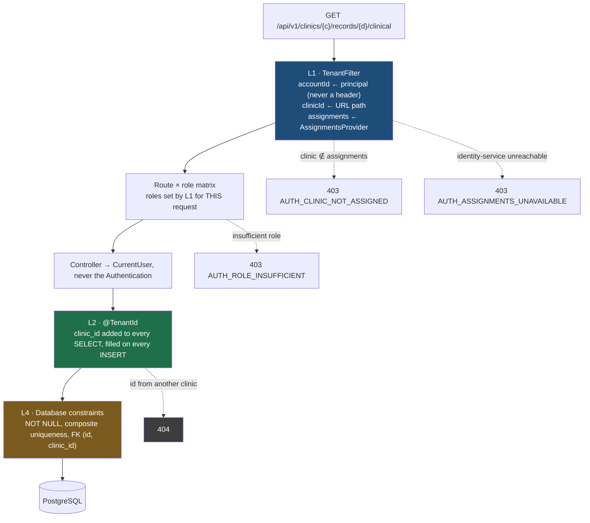

# Multi-tenant isolation — the four layers

> The technical core of the foundation. **None of the four is sufficient alone, and that's
> deliberate**: each one has a documented blind spot that the others cover. Removing them one by
> one removes a safety net each time — it isn't simplifying.
>
> Design: `Security/MVP/01-identite-et-multi-tenant.md` §4.

## The cross-cutting principle: fail-closed

If the tenant context is missing on a tenant resource, the answer is a **refusal**. Never a neutral
value, never "no filter, so everything". It's the costliest bug in any multi-tenant architecture:
the missing filter that silently returns the whole database.

## A request's path

## L1 — Resolution & validation *(covers I2)*

`shared` · `security/tenant/TenantFilter`

In order, and the order matters:

1. `accountId` comes from the **authenticated principal** — never a header, never a parameter.
2. `clinicId` is read from the **URL path** (`/api/v1/clinics/{clinicId}/…`).
3. Assignments are loaded (one call per request, memoized by the resolver).
4. A clinic absent from the assignments → **immediate `403`, no exception**.
5. Only then: `TenantContext` is set, and the clinic's roles are set as authorities **for the
   duration of this request only**.

> **Rejected alternative**: an ambient "active clinic" via an `X-Clinic-Id` header. Rejected
> because it makes the tenant **invisible in a log and in a code review**. In the URL, it's visible.

**The role is set here, and nowhere else.** "Being a practitioner" means nothing until the clinic
is known — so the principal carries none. This is the choice guide 7.1 asks to make explicitly:
authorities set by L1, rather than a homemade `AuthorizationManager`. It's what lets every service
write its matrix with plain `hasRole(…)`.

The context is **always cleared in a `finally`**: a pool thread keeps its `ThreadLocal`s, and a
forgotten value would be inherited by the next request — someone else's.

## L2 — Automatic Hibernate filtering

`shared` · `security/tenant/TenantIdentifierResolverBase` + `TenantJpaConfiguration`

`@TenantId` on the `clinicId` field of **every** tenant entity, with the one named exception of
`Member` (`SEC-13`). Intended effect: `SELECT`s are filtered and `INSERT`s are filled in **without
the developer thinking about it** — that's what makes the invariant sustainable as the team grows.

> **The resolver doesn't throw, and that's deliberate.** Hibernate consults the resolver when the
> **session** opens, not when an entity is accessed — so well before it's known whether the request
> will touch a tenant table. A `throw` would also break the two reads the foundation needs before
> any tenant exists: the `account` used at login, and the `member` rows L1 reads by `account_id`.
>
> So the fail-closed behavior lives in the **value**: `TenantContext.NONE`, a null UUID that no
> clinic can ever have. A tenant entity read under this tenant returns nothing; a write is rejected
> by its foreign key. **Never "no filter, so everything".**

The resolver is registered as a **Hibernate property** (`HibernatePropertiesCustomizer`), not as a
plain bean: Hibernate reads it when building the `SessionFactory`, and a bean discovered later would
be **silently** ignored — the classic "tests pass, production leaks".

## L3 — Application-level guardrails

Three rules, none optional:

| Rule | Invariant | Implementation |
|---|---|---|
| **Fail-closed**: tenant operation with no context → refusal | I8 | `TenantContext.requireClinicId()` → `403 AUTH_CLINIC_CONTEXT_MISSING` |
| **No native SQL / bulk JPQL** on tenant tables | I9 | INV-3 (ArchUnit). An override is possible, but **named, written, and tested**: `@TenantOverride` |
| **Crossing threads**: consumers, `@Async`, scheduled jobs | I7 | `TenantContext.runIn(clinicId, …)`, mandatory and explicit |

**The foundation's only override** is the outbox relay (`OutboxRelay` / `OutboundEventRepository`).
It has no request, so no clinic, and it has to drain events for **every** tenant; it does so with a
native `SELECT … FOR UPDATE SKIP LOCKED` query. Its cross test checks both halves of what makes the
override acceptable: the relay **sees** both clinics, and the entity read — the one used everywhere
else in the code — **sees only one**.

**I7 is not a suggestion.** A consumer starts with an empty context: `clinicId` travels in the
event's **envelope**, and the consumer explicitly resets it before any repository access. Without a
`clinicId`, it must **fail**, not work unfiltered — that's criterion 9, proved by a test consumer
against a real broker.

## L4 — Database constraints

The last-resort safety net: it turns an application bug into an **insert error** rather than a
silent leak. Constraint details in [`identity-model.md`](identity-model.md).

## L5 — Row Level Security: **out of scope for the foundation**

Defense in depth, deferred to Hardening. Note for the day it's turned on:
`ENABLE ROW LEVEL SECURITY` alone is **not enough** — the table owner bypasses the policy unless
`FORCE ROW LEVEL SECURITY` is also active.

## The two refusals of criterion 5, which must never be confused

| Case | `alice`'s request (PRACTITIONER@A) | Response | Who refuses |
|---|---|---|---|
| **5a** | `/api/v1/clinics/`**`B`**`/records/{id}/clinical` | **`403`** | **L1** — B is not among her assignments |
| **5b** | `/api/v1/clinics/`**`A`**`/records/{idOfB}/clinical` | **`404`** | **L2** — `@TenantId` finds no resource |

In 5a, `alice` has no business in clinic B's space, and saying so reveals nothing: clinic B is a
public entity. In 5b, answering `403` would reveal that this identifier **exists** somewhere — `404`
reveals nothing. That's the difference between "you're not allowed in here" and "there's nothing
here **for you**".

**An implementation that answers `403` in both cases passes a test that only checks 5a**, while
leaking the resource's existence in 5b. The two are tested **separately**, on every tenant entity:
`TenantIsolationTest.criterion5a…` and `…criterion5b…`.

## No `/api/v1/me/**` route at the foundation

No patient account or session (`SEC-02`), so no patient principal. Nothing to implement: the
matrix's last line (`denyAll()`) refuses them, and criterion 11 proves it with a **negative test**.
The "outside tenant" exception to L1 — a `patient_id` filter, a named allowlist, a dedicated
ownership test — will only be written the day the patient portal is decided.

## Traps that each cost an incident somewhere

- `clinic_id` nullable "just for the migration".
- A resolver that returns a **default** value instead of an error: disguised fail-open, invisible.
- `@DataJpaTest` without a tenant resolver: tests pass, production leaks.
- An application cache indexed without `clinic_id`.
- Mocking the resolver in an integration test: you're testing the mock, not the isolation.
