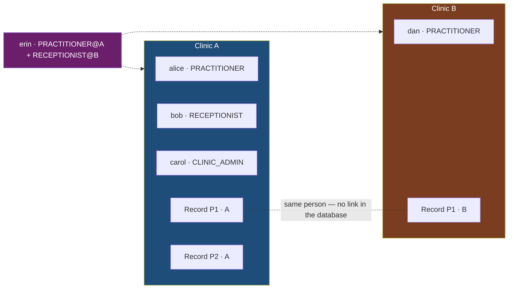

# Security tests & acceptance criteria

> **Invariant I10: an untested rule doesn't exist.** The other documents describe an intent; this
> one describes what proves it.
>
> Design: `Security/MVP/04-tests-et-criteres-dacceptation.md`.

## The reference dataset

One single dataset, shared by **every** test in **every** service: `SecurityFixtures`, published by
`shared` as a `test-jar`. A cross test only makes sense if both sides use the same clinic ids.



**Every cross test boils down to checking that a blue piece of data never shows up in an orange
response.** Two fixtures carry most of the weight:

| Fixture | What only it can prove |
|---|---|
| **`erin`** PRACTITIONER@A + RECEPTIONIST@B | The role is carried by the assignment, not the account (I3). A "role on the account" model **can't express this**. |
| **`P1·A` and `P1·B`** — same phone number, same date of birth, **no link at all in the database** | B's record never shows up on A's side: neither its content, nor its existence (`SEC-04`). |

> ⚠️ **B's data must actually exist.** A tenant test that passes because it's absent proves nothing,
> and nobody notices. `TenantIsolationTest.clinicBsDataReallyExists` checks this
> explicitly, before everything else.

Records are inserted **by the fixtures, never through an API**: the `care` skeleton has no write
route (`SEC-14`), and a fixture going through the API would make the tests depend on the very rules
they're checking.

## What the tests target: the `care` skeleton — `SEC-14`

These tests need real tenant entities and a real clinical route, but no business feature exists yet
in V0. Hence a **named exception to the anti-scope**: 2 business tables + the access log, 2 reads,
**0 writes, 0 UI**. Any extension before V1 requires an ADR — and
`CareInventoryTest.sec14TheSkeletonHasNoWriteRoute` checks it on every build.

## The six families

| Family | What it proves | Classes |
|---|---|---|
| **F1 · Authentication** | Protected route with no session → `401`; invalidated session → `401` | `AuthenticationTest` |
| **F2 · Route authorization** | Every matrix cell, ✅ **and** ❌ — a **parameterized** test driven by `matrice.csv` | `IdentityAuthorizationMatrixTest`, `CareAuthorizationMatrixTest` |
| **F3 · Tenant isolation** | `alice`@A reaches **no** resource of B, entity by entity | `TenantIsolationTest`, `MemberSec13Test` |
| **F4 · Ownership** | No `/me/**` route exposed (negative test) | `TenantIsolationTest.criterion11…` |
| **F5 · Field leak** | Assertion on the **serialized JSON**, never on the DTO's class | `FieldLeakTest` |
| **F6 · Inventory** | INV-1 to INV-6 — tests on the **code**, not on a behavior | `IdentityInventoryTest`, `CareInventoryTest` |

**Testing a ❌ proves as much as a ✅.** Checking that a practitioner reaches the record proves
nothing about isolation; checking that the receptionist **can't**, does. Half the matrix's cells
are ❌, and the parameterized test runs every one of them.

**F5 asserts on the JSON, not the type.** That's what actually leaves the server: a test that
checks "the handler returns an `AdministrativeRecordDto`" would stay green through a Jackson mixin, a
`@JsonUnwrapped`, or a global serializer that put a clinical field back on the wire.

## The inventory tests — the most cost-effective in the whole set

They don't just check that a rule is honored **today**, but that it **can't be worked around
tomorrow** — including by someone who has never opened this document. It's the only mechanism that
survives a team change, and that alone justifies the ArchUnit dependency.

| Test | Catches | Notable trait |
|---|---|---|
| **INV-1** | A route added without updating the matrix — including debug and export endpoints | Checked in **both directions**: a matrix line whose route has disappeared also fails |
| **INV-2** | A `clinicId` entity added without `@TenantId` — **or a second exemption slipped into the allowlist** | Allowlist: `[Member]` on `identity`, **empty** on `care` |
| **INV-3** | A filter bypass via native SQL or bulk JPQL | Forbids the **undeclared**, not the override: `@TenantOverride` requires a written reason |
| **INV-4** | A `RoleHierarchy` reintroduced "to simplify things" | Checked both in the **code** and in the **context**: a bean can come from a starter |
| **INV-5** | An administrative DTO referencing a clinical type — at compile time, not at runtime | |
| **INV-6** | A direct read of `Authentication` / `Jwt` / `HttpSession` outside `CurrentUser` | **Named** exceptions: the authentication controller **is** the mechanism |

### INV-1 has to have been seen failing — guide 10.8

"Add an undeclared endpoint, watch CI go red, then remove it" proves the point the day you do it,
and never again after. `InventoryIntentionallyFailsTest` makes the proof **permanent**: an
undeclared debug controller lives in a separate context, and the assertion is **inverted** — this
class fails if INV-1 stops catching it. It also checks the other half of the promise: the undeclared
route is **refused** by `denyAll()`, not just flagged.

## The thirteen acceptance criteria

| # | Criterion | Proved by |
|---|---|---|
| 1 | No session → `401`; invalidated session → `401` | `AuthenticationTest` |
| 2 | Every matrix cell, ✅ **and** ❌ | `IdentityAuthorizationMatrixTest`, `CareAuthorizationMatrixTest` |
| 3 | An endpoint outside the matrix fails CI | `InventoryIntentionallyFailsTest` + `IdentityInventoryTest.inv1…` |
| 4 | `alice`@A reaches no resource of B, **entity by entity** | `TenantIsolationTest.criterion4…` |
| 5 | **The two distinct refusals**: `403` (5a) and `404` (5b) | `…criterion5a…` and `…criterion5b…`, **separately** |
| 6 | `erin` sees A's clinical data and **not** B's | `…criterion6…` |
| 7 | The JSON served to `bob` has **no** clinical key | `FieldLeakTest.criterion7…` |
| 8 | `carol` → `403` on every clinical route | `CareAuthorizationMatrixTest` (`CLINIC_ADMIN` rows) |
| 9 | An event with no `clinicId` **fails**, it doesn't write | `ConsumerWithoutTenantTest.criterion9…` |
| 10 | A tenant operation with no context → refusal, never a complete result | `…criterion10…`, `MemberSec13Test.withNoClinicContext…` |
| 11 | No `/api/v1/me/**` route exposed | `…criterion11…` (negative test) |
| 12 | `identity-service` unreachable → `403`, never a bypass | `AssignmentsUnavailableTest` |
| 13 | Everything runs in CI and **blocks** the merge | `.github/workflows/ci.yml` + required *status check* |

### Criteria 9 and 12 deserve a note

These are the two that **never show up when everything works**. A fail-open is invisible until
something actually breaks: you have to break something on purpose.

- **9** tests a path **outside any HTTP request** — a test Kafka consumer, since no business
  consumer exists at the foundation. On a real broker, on a thread that has never seen a request.
- **12** tests a **real outage**: the assignments source is cut, and `care` refuses instead of
  serving unfiltered. Twice, at two levels — the whole chain, then the real HTTP client against a
  real server that's stopped.

## CI wiring

```bash
cd server && mvn -B clean verify   # exactly what CI runs
```

- Security tests run in the **standard `mvn verify`** — not in a separate profile, which would
  eventually stop being activated.
- CI **counts the tests executed** and fails below a floor: a green CI that ran nothing is a known
  trap (a broken surefire configuration, a module dropped from the reactor).
- **No `@Disabled` on a security test** — CI refuses it. Treat this as a serious fault from the very
  first time, on the same footing as "making CI green by deleting the test".
- There is still **one manual, unscriptable step**: ticking the required *status check* on `develop`
  and `main` (Settings → Branches). **Until it's ticked, criterion 13 is not satisfied.**

## Test infrastructure

Everything runs on the **real thing**: Postgres, Redis and Kafka in containers (Testcontainers),
using the **same images as `docker-compose.yaml`**. What's tested *is* the engine — the filter is
Hibernate's own, the composite FK and the append-only trigger are Postgres's own, the shared session
is Redis's own. The containers start **once for the whole build**: a slow security suite is a suite
people eventually stop running.

> Mocking the tenant resolver in an integration test amounts to testing the mock. It's one of three
> classic traps in this area, along with "writing the tests after the code" (they then describe the
> behavior obtained, not the one intended) and "the test passes because B's data doesn't exist".

## Where the tests are

```
server/
├── shared/src/test/java/com/clinexa/shared/security/
│   ├── fixtures/SecurityFixtures.java        ← the dataset, published as a test-jar
│   ├── fixtures/AuthorizationMatrix.java     ← reads matrice.csv (F2, INV-1)
│   ├── fixtures/InventoryRules.java          ← INV-2..INV-6, written ONCE
│   ├── fixtures/InventoryRulesTest.java      ← proves INV-3 actually bites
│   ├── identity/SessionCurrentUserResolverTest.java
│   ├── tenant/TenantContextTest.java
│   └── web/SecurityChainBuilderTest.java
├── platform/api-gateway/src/test/java/com/clinexa/apigateway/
│   └── SessionLeakTest.java                  ← the gateway keeps no cookie
├── services/identity-service/src/test/java/com/clinexa/identity/
│   ├── security/{Authentication,IdentityAuthorizationMatrix,IdentityInventory,InventoryIntentionallyFails,CsrfBootstrap}Test.java
│   ├── member/MemberSec13Test.java
│   ├── outbox/OutboxRelayTest.java
│   ├── common/SchemaAndEntitiesTest.java
│   └── authentication/PasswordHashTest.java
└── services/care-service/src/test/java/com/clinexa/care/
    ├── record/TenantIsolationTest.java
    ├── accesslog/AccessLogTest.java
    └── security/{CareAuthorizationMatrix,FieldLeak,AssignmentsUnavailable,ConsumerWithoutTenant,CareInventory,UnmaskedError}Test.java
```
